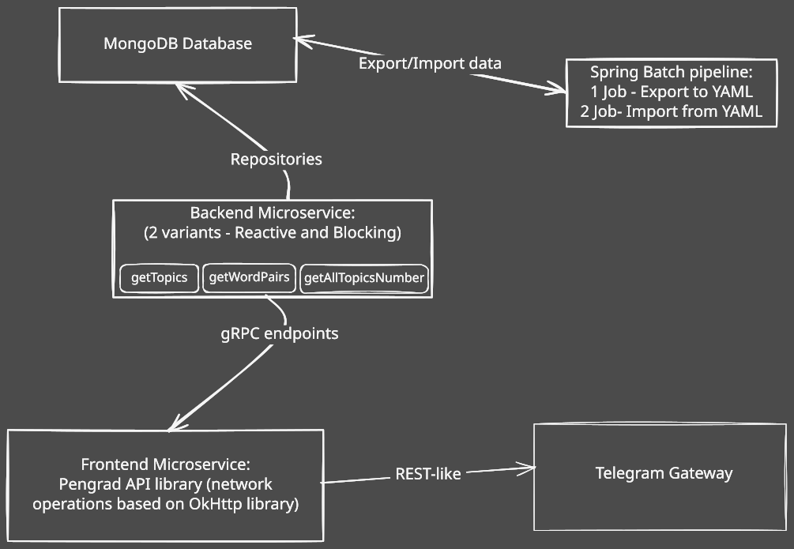

# fw01-back-mongo-common

## Technology Stack
- **Language**: Java 21
- **Database**: MongoDB
- **Framework**: Spring Boot 3.5.6
- **Database**: MongoDB (Spring Data MongoDB, Mongock v4.3.8 for migrations)
- **API**: gRPC (Spring gRPC Server/Client v0.11.0, protoc-gen-grpc-java v1.74.0, Protobuf v4.31.1)
- **Build Tool**: Maven
- **Utilities**: Lombok, MapStruct v1.6.3
- **Security**: mTLS/SSL (JKS keystores)
- **Testing**: Spring Boot Test, JaCoCo, Checkstyle
- **Embedded DB**: Flapdoodle Embed MongoDB v4.21.0 (for tests)

## Functional Description
Microservices: backend (reactive and synchronous editions) providing a 2 microservices dictionary service.

### gRPC Server (`DicService` on port 9090):
- `getTopics(Empty) returns (stream StringValue)`: Streams all topic names.
- `getWordPairs(StringValue) returns (stream WordPair)`: Streams bilingual word pairs (`map<string, string>`, e.g., Hebrew to Russian) for a given topic.
- `getAllTopicsNumber(Empty) returns (Int64Value)`: Returns total number of topics.

### gRPC Client:
- Implements a Telegram bot as Words quiz.

### Core Features:
- Manages `Topic`, `Word`, and `Concept` entities in MongoDB database `dictionary-db`.
- `TopicService` and `WordService` for CRUD and query operations (e.g., `getHeRuWordPairs`).
- `GrpcDicServerService` implements the gRPC endpoints.
- Database migrations via Mongock (`DatabaseChangelog`).
- Logging interceptor and global config.